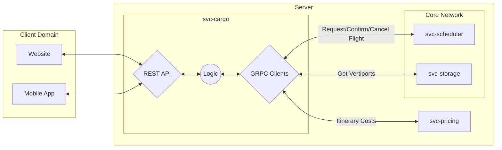
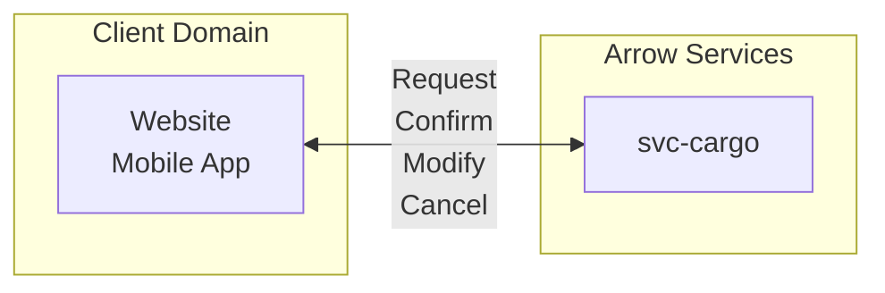
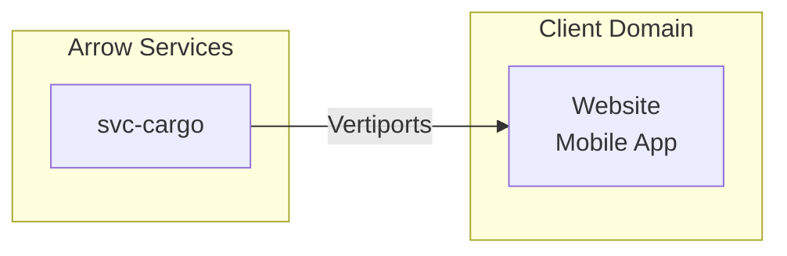

# Concept of Operations - `svc-cargo`

## :telescope: Overview

This microservice allows external processes to make requests to the network through a RESTful API.

### Metadata

Item | Value
--- | ---
Maintainer(s) | @arrow-air/services
Stuckee | A.M. Smith ([@ServiceDog](https://github.com/ServiceDog))

:exclamation: This document is intended for internal use.

## 1.0 Project Description

#### 1.0.1 Background

This service provides an interface for shippers to book, modify, and cancel cargo shipments.

It is not essential to the function of the core network. It exposes a public REST interface and translates valid requests from external clients into messages to the core network.

#### 1.0.2 Overview of the Envisioned System

 

`svc-cargo` exposes a REST API for external applications to make cargo-related requests. External applications include websites and mobile applications.

Valid REST requests may trigger associated RPC calls to other microservices. Replies will route through `svc-cargo` and then to the external client. No external requests shall penetrate directly to the core network, nor shall replies from the core network route directly to the external client.

A full description of interfaces can be found in the [ICD](./icd.md).

## 2.0 Applicable Resources

#### 2.0.1 Documents

Document | Description
--- | ---
| [High-Level Concept of Operations (CONOPS)](https://github.com/Arrow-air/se-services/blob/develop/docs/conops.md) | Overview of Arrow microservices.                             |
| [High-Level Interface Control Document (ICD)](https://github.com/Arrow-air/se-services/blob/develop/docs/icd.md)  | Interfaces and frameworks common to all Arrow microservices. |
[Requirements - `svc-cargo`](https://nocodb.arrowair.com/dashboard/#/nc/view/e2768805-2034-42e2-a7d5-8884c841d8a3) | Requirements and user stories for this microservice.
[Software Design Document - `svc-cargo`](./sdd.md) | Defines the implementation of this interface.
[Interface Control Document (ICD) - `svc-cargo`](./icd.md) | Defines the inputs and outputs of this microservice.

## 3.0 Needs, Goals and Objectives of Envisioned System

This service is expected to:
- Handle many (100+) client requests per second for a region of operation.
- Translate valid REST API requests into well-formed messages to the core network.
    - Acts as a gating layer to shield core network functionality from ill-formed requests or malicious attacks.
- Return information to the client in a reasonable time frame (on the order of seconds).

## 3.1 External Interfaces

This is a general overview of external interfaces and capabilities.

A full description of interfaces can be found in the [ICD](./icd.md).

#### 3.1.1 Flights

 

 

`svc-cargo` exposes a public REST API for clients to:
- Query available flights
- Receive flight information
- Confirm flights
- Modify created flights
- Cancel created flights

#### 3.1.2 Regional Data

 

The service exposes an interface to request:
- A list of vertiports for a region, including names and coordinates

## 4.0 Nominal & Off-Nominal Conditions

Nominal and off-nominal conditions will be addressed by service-level requirements, which will link up to high-level requirements. These documents are still being developed.

## 4.1 Modes of Operation

Mode | Description
--- | ---
Nominal | Accept all valid incoming requests.
Maintain | Forbid new flight requests, allow limited modifications and cancellations.
Offline | Unable to accept any type of request; dependencies unavailable.

## 5.0 Physical Environment

See the High-Level Services CONOPS.

## 6.0 Support Environment

See the High-Level Services CONOPS.

## 7.0 Impact Considerations

See the High-Level Services CONOPS.

## 8.0 Risks and Potential Issues

***Attack Vector***

As a public interface, this service will be probed by malicious attacks of various forms (injections, distributed denial of service (DDoS), broken authentication, and so on).

***Sensitive Data***

Users will request personal data through this service including ride history, vertiport defaults, and other sensitive information. Data traffic to and from this service should be encrypted for user privacy.

## Appendix A: Acronyms & Glossary

See the [Arrow Glossary](https://www.arrowair.com/docs/documentation/glossary).
