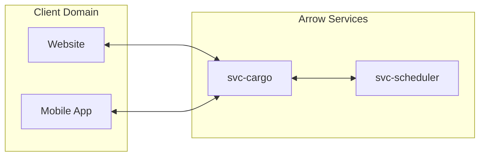
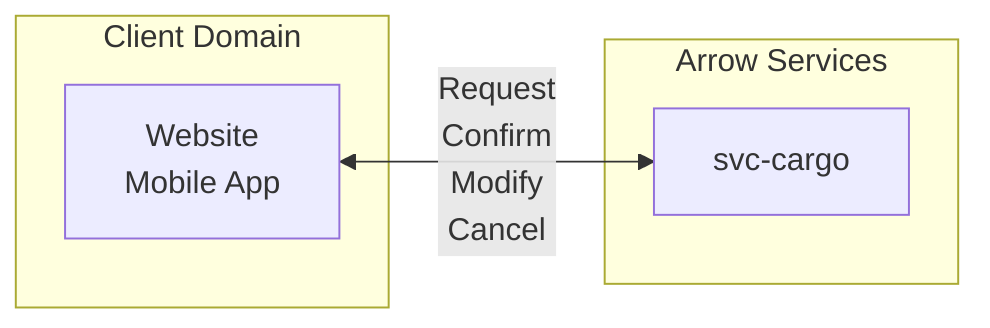

# Concept of Operations - `svc-cargo`

Item | Value
--- | ---
Maintainer(s) | @arrow-air/services

:exclamation: This document is intended for internal use.

## 1.0 Project Description

#### 1.0.1 Background

Handles interaction with mobile and web clients.

This service compiles necessary information from the customer and submits well-formed requests to the `svc-scheduler`.

#### 1.0.2 Assumptions and Constraints

TODO

### 1.1 Overview of the Envisioned System

#### 1.1.1 Overview

 

 

## 2.0 Documents
### 2.1 Applicable Resources

| Resource | Type |
| --- | --- |
| :construction: Services CONOPS | Services Concept of Operations

## 3.0 Description of Envisioned System

TODO

### 3.1 Needs, Goals and Objectives of Envisioned System

Handle simultaneous client requests for a region of operation

### 3.2 Overview of System and Key Elements

Queued client requests

### 3.3 External Interfaces

 

 

`svc-cargo` exposes a public API for clients to:
- Query available flights
- Receive possible flight information
- Confirm flights
- Modify confirmed flights
- Cancel confirmed flights

### 3.4 Proposed Capabilities

TODO

### 3.5 Modes of Operations

TODO

## 4.0 Operational Scenarios, Use Cases and/or Design Reference Missions

TODO

### 4.1 Nominal & Off-Nominal Conditions

Nominal and off-nominal conditions will be addressed by service-level requirements, which will link up to high-level requirements. These documents are still being developed.

Existing documents in this realm include:
- [Services User Stories](https://docs.google.com/spreadsheets/d/1Ad238NAEj6QUzgsjPTRRFJy6NiQVQt2e7affwVVDAFo/edit#gid=0)
- [Visualized Rideshare Scenarios (Slides)](https://docs.google.com/presentation/d/1Nt91KVIczhxngurfyeIJtG8J0m_38jGU1Cnqm1_BfPc/edit#slide=id.p1)

## 5.0 Physical Environment

See the Services CONOPS.

## 6.0 Support Environment

See the Services CONOPS.

## 7.0 Impact Considerations

See the Services CONOPS.

## 8.0 Risks and Potential Issues

Public interface 

Must vulnerable to attack

## Citations

TODO

## Appendix A: Acronyms & Glossary

See the [Arrow Glossary](https://www.arrowair.com/docs/documentation/glossary).
