# `svc-cargo` - Software Design Document (SDD)

## :telescope: Overview

This document details the software implementation of `svc-cargo`.

This process is responsible for handling interactions with clients for cargo shipments.

Interactions include querying for available flights, creating flights, and cancelling flights.

This service will primarily communicate with a client-side user interface, such as a website or mobile application. It stands between clients and the core Arrow services network, denying ill-formed requests and limiting traffic.

Attribute | Description
--- | ---
Status | Development
Stuckee | A.M. Smith ([@ServiceDog](https://github.com/ServiceDog))

## :books: Related Documents

Document | Description
--- | ---
| [High-Level Concept of Operations (CONOPS)](https://github.com/Arrow-air/se-services/blob/develop/docs/conops.md) | Overview of Arrow microservices.                             |
| [High-Level Interface Control Document (ICD)](https://github.com/Arrow-air/se-services/blob/develop/docs/icd.md)  | Interfaces and frameworks common to all Arrow microservices. |
[Requirements - `svc-cargo`](https://nocodb.arrowair.com/dashboard/#/nc/view/e2768805-2034-42e2-a7d5-8884c841d8a3) | Requirements and user stories for this microservice.
[Concept of Operations - `svc-cargo`](./conops.md) | Defines the motivation and duties of this microservice.
[Interface Control Document (ICD) - `svc-cargo`](./icd.md) | Defines the inputs and outputs of this microservice.

## :dna: Module Attributes

Attribute | Applies | Explanation
--- | --- | ---
Safety Critical | No | This is a client-facing process that is not essential to the function of the underlying services network.

## :gear: Logic 

### Initialization

At initialization this service creates two servers on separate threads: a GRPC server and a REST server.

The REST server expects the following environment variables to be set:
- `DOCKER_PORT_REST` (default: `8000`)

The GRPC server expects the following environment variables to be set:
- `DOCKER_PORT_GRPC` (default: `50051`)

### Control Loop

As a REST and GRPC server, this service awaits requests and executes handlers.

Some handlers **require** the following environment variables to be set:
- `SCHEDULER_HOST_GRPC`
- `SCHEDULER_PORT_GRPC`
- `PRICING_HOST_GRPC`
- `PRICING_PORT_GRPC`
- `STORAGE_HOST_GRPC`
- `STORAGE_PORT_GRPC`

This information allows `svc-cargo` to connect to other microservices to obtain information requested by the client.

:exclamation: These environment variables will *not* default to anything if not found. In this case, requests involving the handler will result in a `503 SERVICE UNAVAILABLE`.

For detailed sequence diagrams regarding request handlers, see [REST Handlers](#speech_balloon-rest-handlers).

### Cleanup

None

## :speech_balloon: REST Handlers

### `query_vertiports` Handler

The client will request a list of vertiports for their region, so they can choose their departure and destination ports.

This handler makes a request to `svc-storage`.

**(vertiports) Nominal**
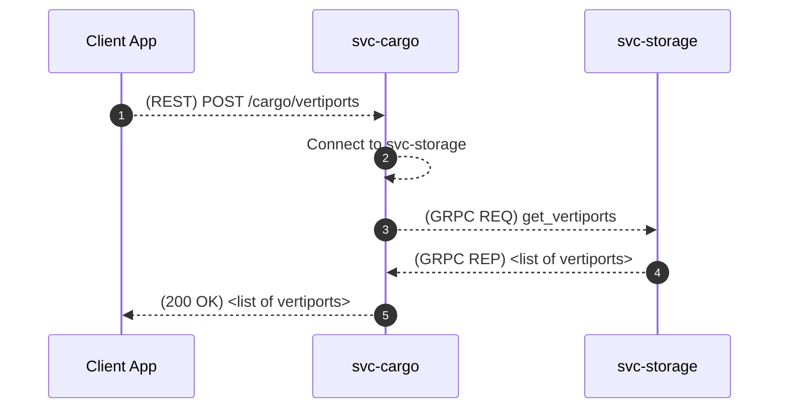

**(vertiports) Off-Nominal**: Failed to connect to svc-storage

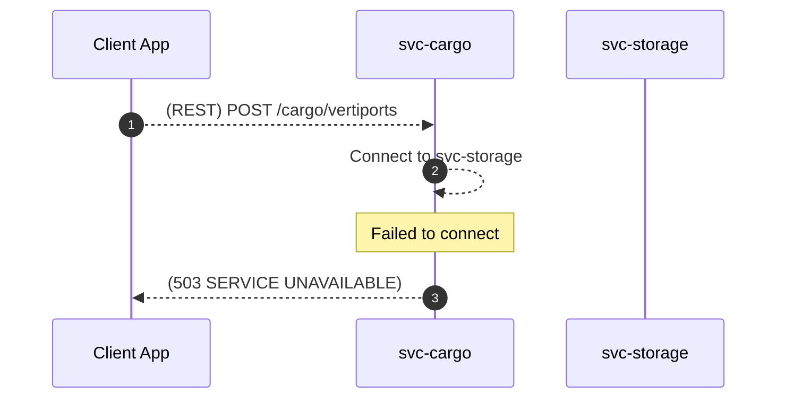

**(vertiports)  Off-Nominal**: Request to svc-storage failed
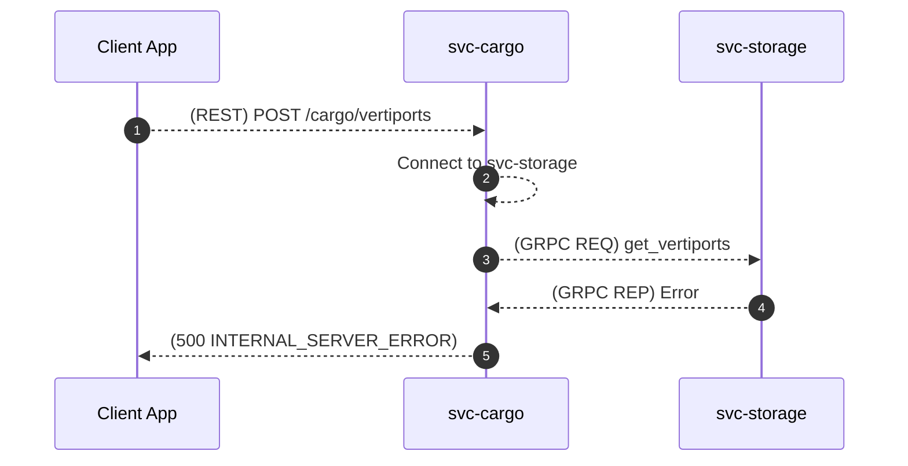

### `query_itineraries` Handler

The client will send a query to `svc-cargo` including vertiports and time of departure. `svc-cargo` will forward valid requests to `svc-scheduler`

This handler makes requests to `svc-scheduler` and `svc-pricing`.

**(query) Nominal**


**(query) Off-Nominal**: Invalid request body

This can occur if invalid time windows or vertiport IDs are provided by the client.

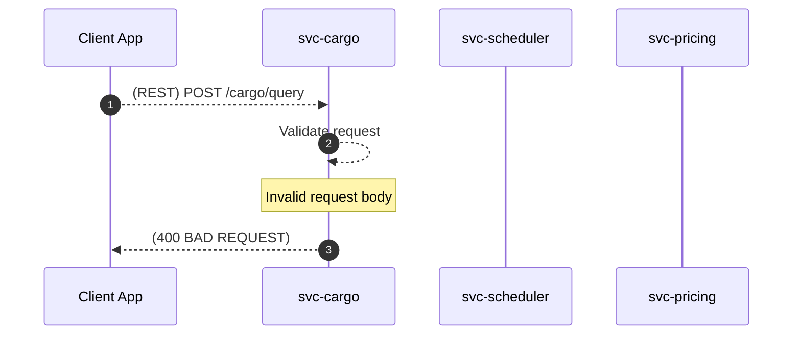

**(query) Off-Nominal**: Unable to connect to svc-scheduler or svc-pricing

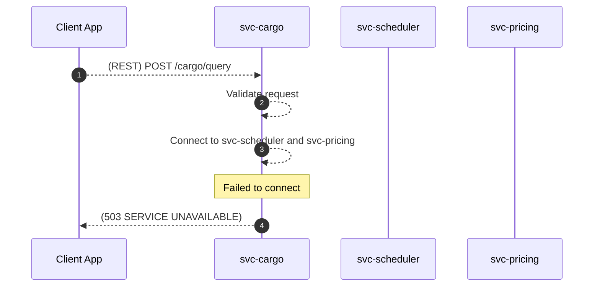

**(query) Off-Nominal**: Request to svc-scheduler fails

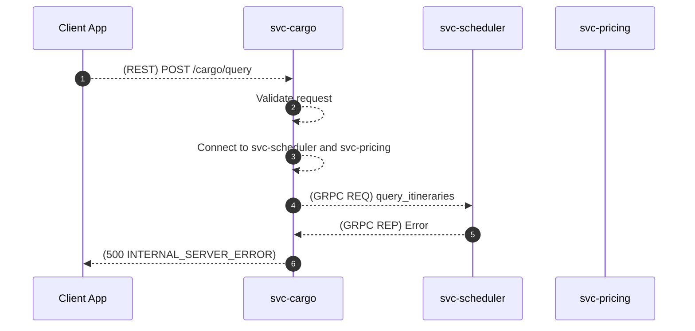

**(query) Off-Nominal**: Request to svc-pricing fails

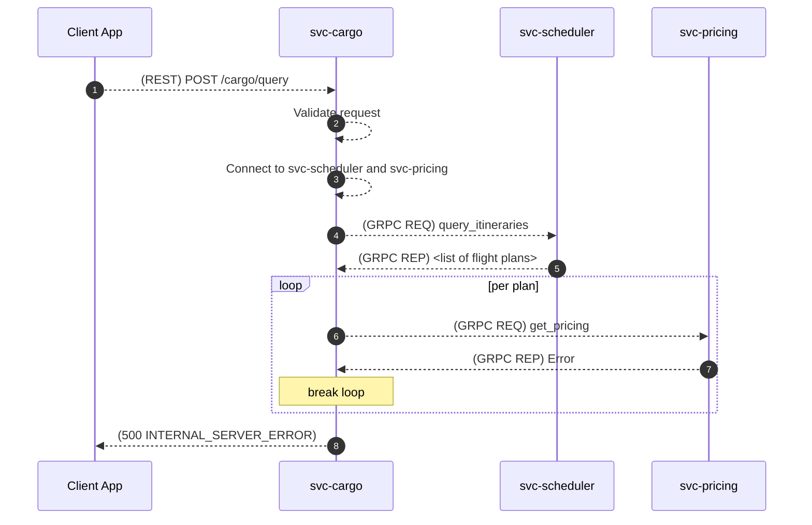

### `create` Handler

The client will choose an itinerary from their list of options and create it through its unique *draft* UUID.

:exclamation: A nominal reply to the client will contain creation and a *new* itinerary UUID that the client must use for future requests (such as cancelling). The original `draft` UUID used to create the itinerary is discarded when an itinerary is created.

This handler makes a request to `svc-scheduler`.

**(create) Nominal**
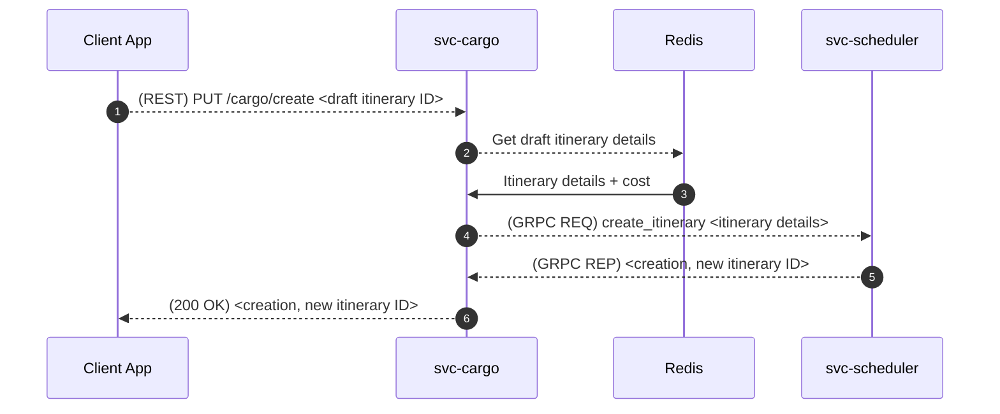

:warning: In R5+, this will also engage the payment service to confirm valid customer information prior to reserving the itinerary.

**(create) Off-Nominal**: Invalid request body

This can occur if an invalid itinerary ID format is provided by the client.


**(create) Off-Nominal**: Unable to connect to Redis

**(create) Nominal**


**(create) Off-Nominal**: Unable to connect to svc-scheduler

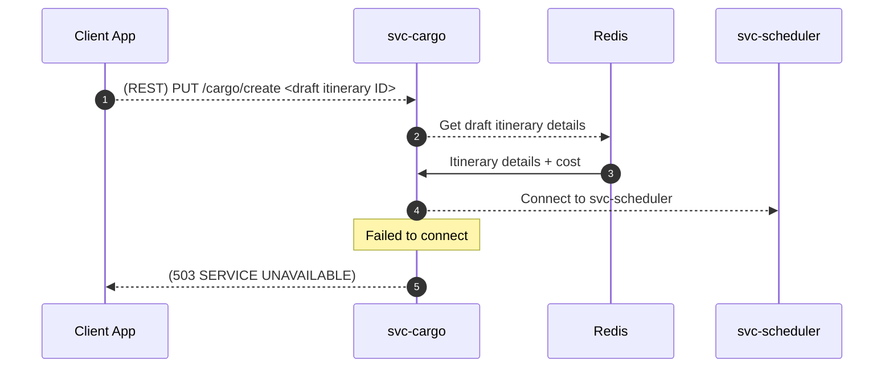

**(create) Off-Nominal**: Request to svc-scheduler fails

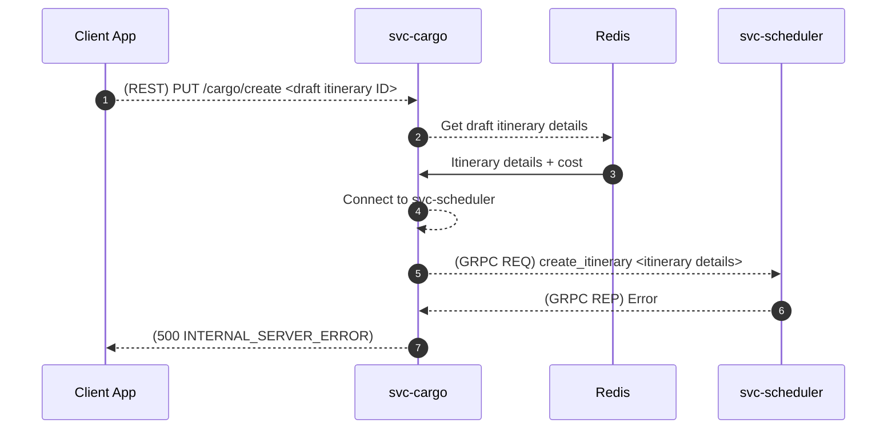

### `cancel` Handler

The client may cancel an itinerary through its unique UUID.

This handler makes a request to `svc-scheduler`.

**(cancel) Nominal**
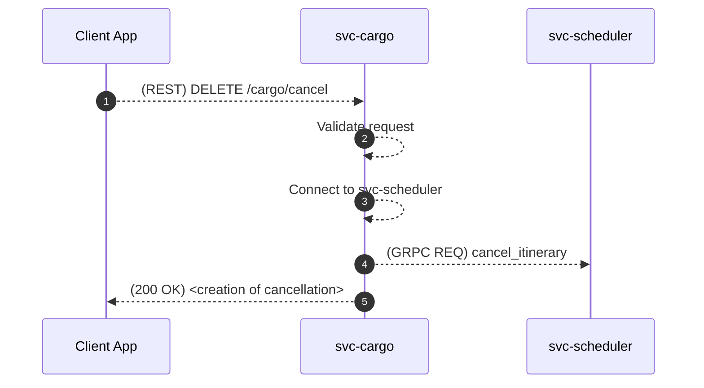

**(cancel) Off-Nominal**: Invalid request body

This can occur if an invalid flight plan ID format is provided by the client.


**(cancel) Off-Nominal**: Unable to connect to svc-scheduler

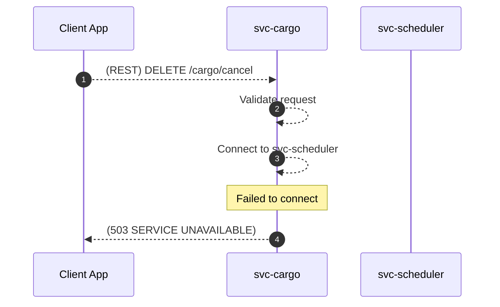

**(cancel) Off-Nominal**: Request to svc-scheduler fails


### `query_occupations` Handler

A vertiport may request a list of upcoming occupations for a specific vertiport, in order to display them on a screen.

**(query_occupations) Nominal**: Request succeeds
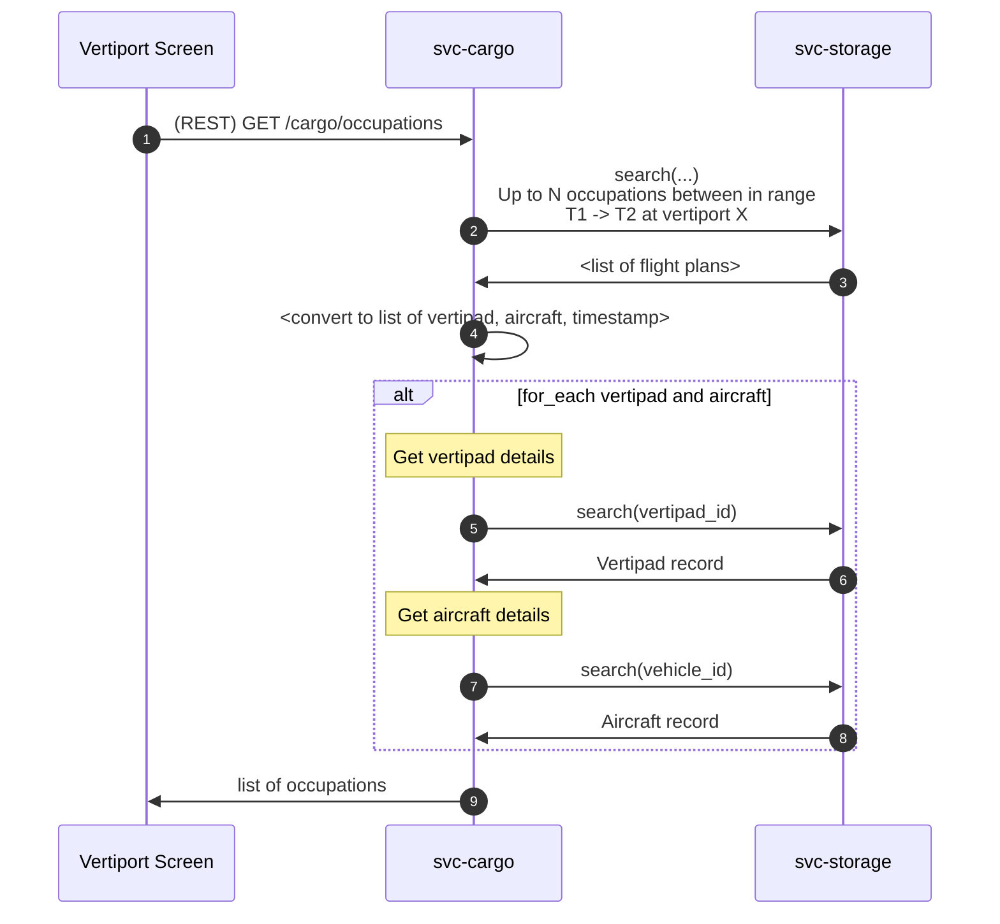

**(query_occupations) Off-Nominal**: Request to svc-storage fails
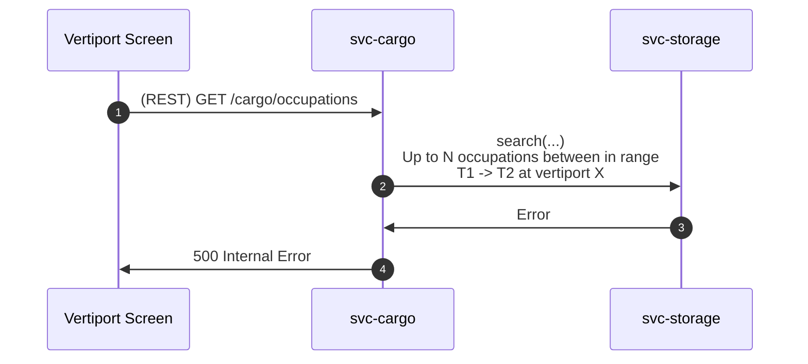

**(query_occupations) Off-Nominal**: Couldn't parse flight plans
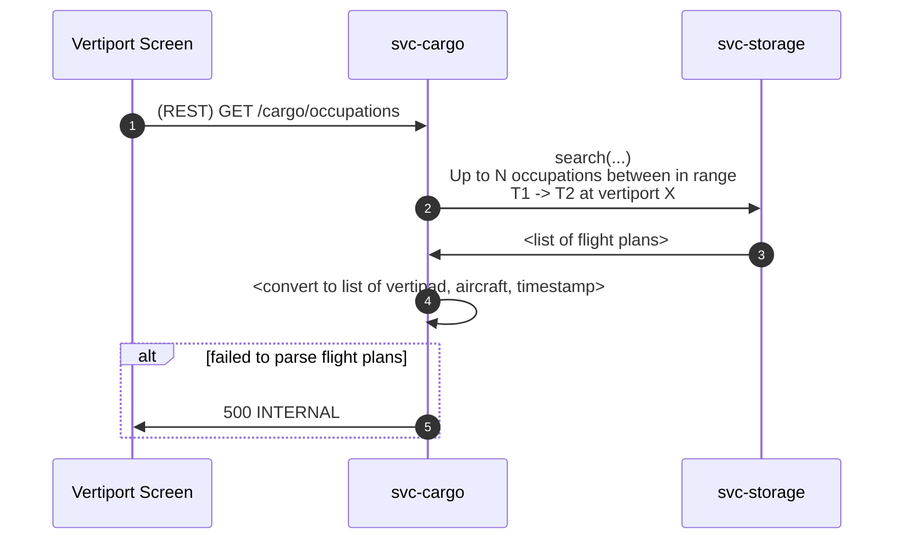

**(query_occupations) Off-Nominal**: Couldn't get vehicle or vertipad details
```mermaid
sequenceDiagram
    autonumber
    participant client as Vertiport Screen
    participant cargo as svc-cargo
    participant storage as svc-storage

    client->>cargo: (REST) GET /cargo/occupations
    cargo->>storage: search(...)<br>Up to N occupations between in range<br>T1 -> T2 at vertiport X
    storage->>cargo: <list of flight plans>
    cargo->>cargo: <convert to list of vertipad, aircraft, timestamp>
    alt for_each vertipad and aircraft
        Note over cargo: Get vertipad details
        cargo->>storage: search(vertipad_id)
        alt Failed
            storage->>cargo: Error
            cargo->>client: 500 INTERNAL
        end
        Note over cargo: Get aircraft details
        cargo->>storage: search(vehicle_id)
        alt Failed
            storage->>cargo: Error
            cargo->>client: 500 INTERNAL
        end
    end
```

### `scan` Handler

This is for a client (handheld scanner, locker, or drone) to scan a parcel and upload its location to the backend.

**(scan) Nominal**: Scanned successfully
```mermaid
sequenceDiagram
    autonumber
    participant client as Vertiport Screen
    participant cargo as svc-cargo
    participant storage as svc-storage

    client->>cargo: (REST) PUT /cargo/scan<br>CargoScan Payload
    cargo->>storage: parcel_scan.insert(...)
    storage->>cargo: Response with validation result
    cargo->>client: success
```

**(scan) Off-Nominal**: Bad Request
```mermaid
sequenceDiagram
    autonumber
    participant client as Vertiport Screen
    participant cargo as svc-cargo
    participant storage as svc-storage

    client->>cargo: (REST) PUT /cargo/scan<br>CargoScan Payload
    alt bad UUID
        cargo->>client: 400 BAD REQUEST
    end
    alt nonsensical coordinates
        cargo->>client: 400 BAD REQUEST
    end
```

**(scan) Off-Nominal**: svc-storage insertion failed
```mermaid
sequenceDiagram
    autonumber
    participant client as Vertiport Screen
    participant cargo as svc-cargo
    participant storage as svc-storage

    client->>cargo: (REST) PUT /cargo/scan<br>CargoScan Payload
    cargo->>storage: parcel_scan.insert(...)
    storage->>cargo: Error
    cargo->>client: 500 INTERNAL
```


**(scan) Off-Nominal**: validation result is `false``
```mermaid
sequenceDiagram
    autonumber
    participant client as Vertiport Screen
    participant cargo as svc-cargo
    participant storage as svc-storage

    client->>cargo: (REST) PUT /cargo/scan<br>CargoScan Payload
    cargo->>storage: parcel_scan.insert(...)
    storage->>cargo: Response with validation result
    alt result is false
        cargo->>client: 500 INTERNAL
    end
```
