# `svc-cargo` - Software Design Document (SDD)

## Overview

This document details the software implementation of `svc-cargo`.

This process is responsible for handling interactions with clients for cargo shipments.

Interactions include querying for available flights, confirming flights, and cancelling flights.

This service will primarily communicate with a client-side user interface, such as a website or mobile application. It stands between clients and the core Arrow services network, denying ill-formed requests and limiting traffic.

Attribute | Description
--- | ---
Status | Development
Stuckee | A.M. Smith ([@ServiceDog](https://github.com/ServiceDog))

## Related Documents

Document | Description
--- | ---
| [High-Level Concept of Operations (CONOPS)](https://github.com/Arrow-air/se-services/blob/develop/docs/conops.md) | Overview of Arrow microservices.                             |
| [High-Level Interface Control Document (ICD)](https://github.com/Arrow-air/se-services/blob/develop/docs/icd.md)  | Interfaces and frameworks common to all Arrow microservices. |
[Requirements - `svc-cargo`](https://docs.google.com/spreadsheets/d/1OliSp9BDvMuVvGmSRh1z_Z58QtjlSknLxGVdVZs2l7A/edit#gid=0) | Requirements and user stories for this microservice.
[Concept of Operations - `svc-cargo`](./conops.md) | Defines the motivation and duties of this microservice.
[Interface Control Document (ICD) - `svc-cargo`](./icd.md) | Defines the inputs and outputs of this microservice.

## Frameworks

See the [High-Level Services ICD](https://github.com/Arrow-air/se-services/blob/develop/docs/icd.md).

## Location

Server-side service.

## Module Attributes

Attribute | Applies | Explanation
--- | --- | ---
Safety Critical | No | This is a client-facing process that is not essential to the function of the underlying services network.

## Global Variables

None

## Logic 

### Initialization

At initialization this service creates two servers on separate threads: a GRPC server and a REST server.

The REST server expects the following environment variables to be set:
- `DOCKER_PORT_REST` (default: `8000`)

The GRPC server expects the following environment variables to be set:
- `DOCKER_PORT_GRPC` (default: `50051`)
### Control Loop

As a REST and GRPC server, this service awaits requests and executes handlers.

Some handlers **require** the following environment variables to be set:
- `SCHEDULER_HOST_GRPC`
- `SCHEDULER_PORT_GRPC`
- `PRICING_HOST_GRPC`
- `PRICING_PORT_GRPC`
- `STORAGE_HOST_GRPC`
- `STORAGE_PORT_GRPC`

This information allows `svc-cargo` to connect to other microservices to obtain information requested by the client.

:exclamation: These environment variables will *not* default to anything if not found. In this case, requests involving the handler will result in a `503 SERVICE UNAVAILABLE`.

For detailed sequence diagrams regarding request handlers, see [REST Handlers](#rest-handlers).

### Cleanup

None

## REST Handlers

### `vertiports` Handler

The client will request a list of vertiports for their region, so they can choose their departure and destination ports.

This handler makes a request to `svc-storage`.

**(vertiports) Nominal**
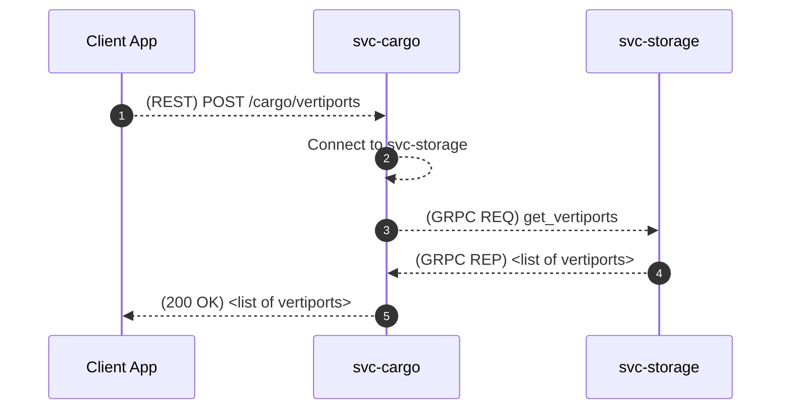

**(vertiports) Off-Nominal**: Failed to connect to svc-storage
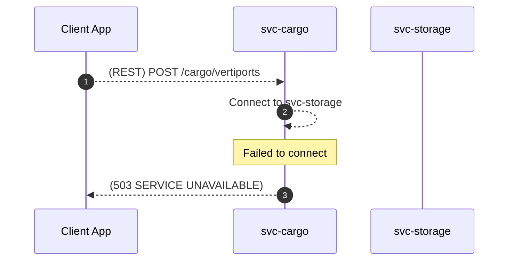

**(vertiports)  Off-Nominal**: Request to svc-storage failed
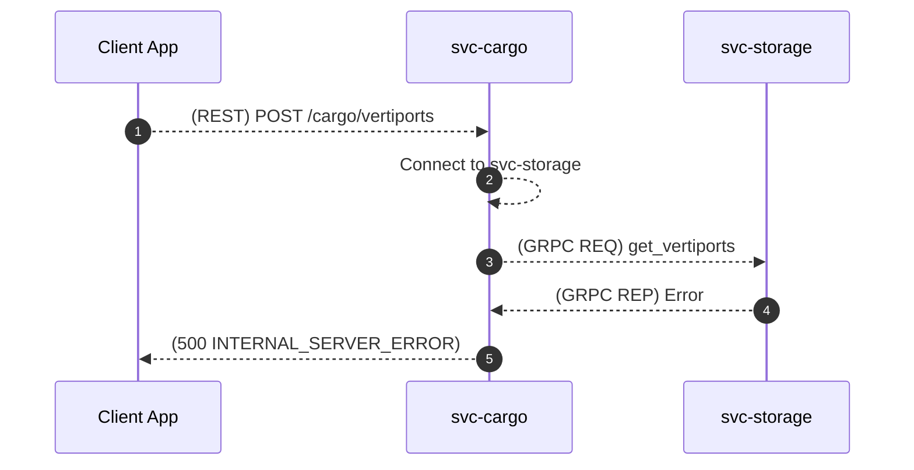

### `query` Handler

The client will send a query to `svc-cargo` including vertiports and time of departure. `svc-cargo` will forward valid requests to `svc-scheduler`

This handler makes requests to `svc-scheduler` and `svc-pricing`.

**(query) Nominal**
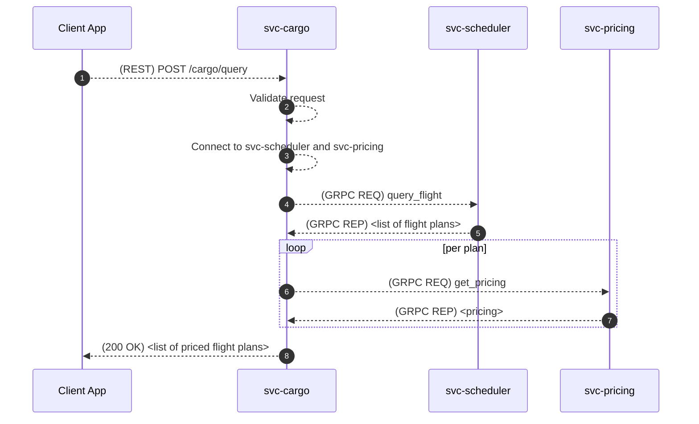

**(query) Off-Nominal**: Invalid request body

This can occur if invalid time windows or vertiport IDs are provided by the client.

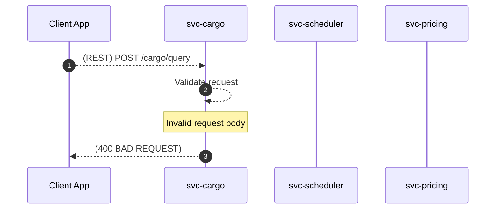

**(query) Off-Nominal**: Unable to connect to svc-scheduler or svc-pricing

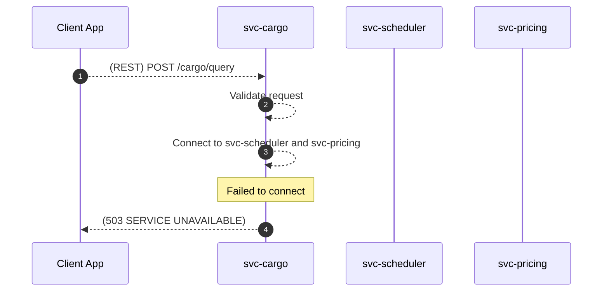

**(query) Off-Nominal**: Request to svc-scheduler fails

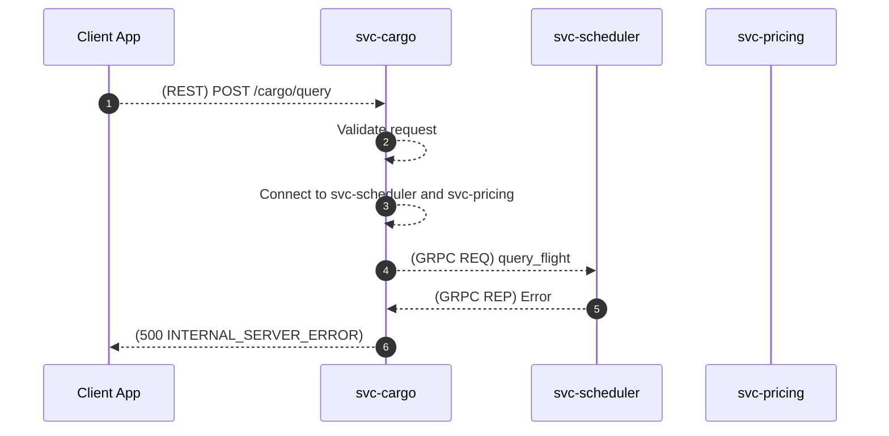

**(query) Off-Nominal**: Request to svc-pricing fails

### `confirm` Handler

The client will choose a flight plan from their list of options and confirm it through its unique *draft* UUID.

:exclamation: A nominal reply to the client will contain confirmation and a *new* flight plan UUID that the client must use for future requests (such as cancelling). The original `draft` UUID used to confirm the flight is discarded when a flight is confirmed.

This handler makes a request to `svc-scheduler`.

**(confirm) Nominal**
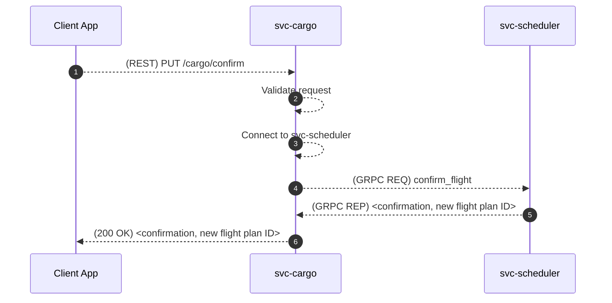

**(confirm) Off-Nominal**: Invalid request body

This can occur if an invalid flight plan ID format is provided by the client.

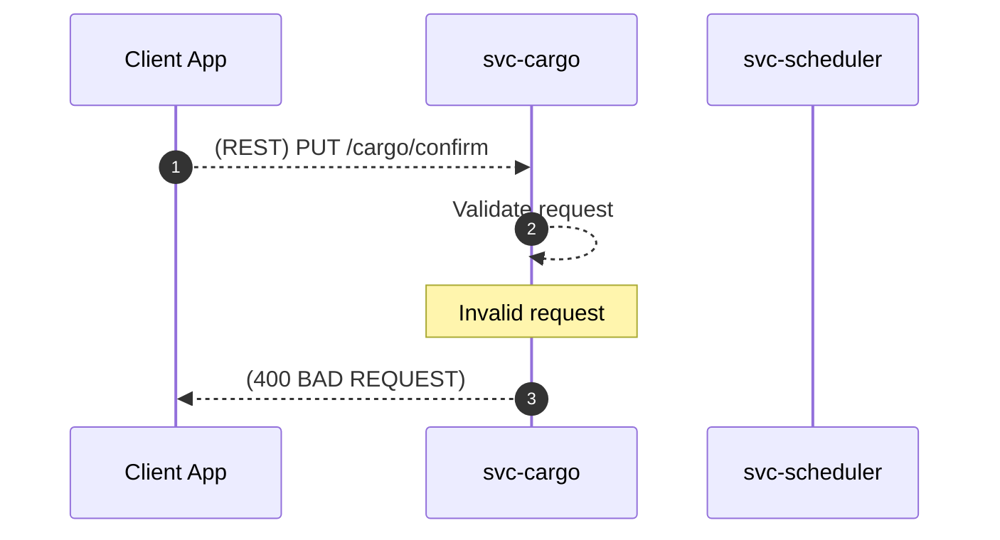

**(confirm) Off-Nominal**: Unable to connect to svc-scheduler

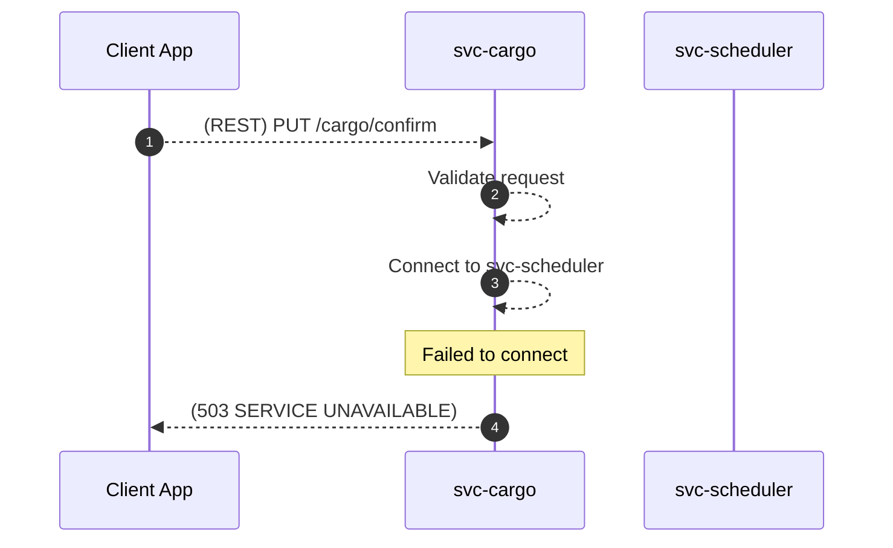

**(confirm) Off-Nominal**: Request to svc-scheduler fails

### `cancel` Handler

The client may cancel a flight plan through its unique UUID.

This handler makes a request to `svc-scheduler`.

**(cancel) Nominal**
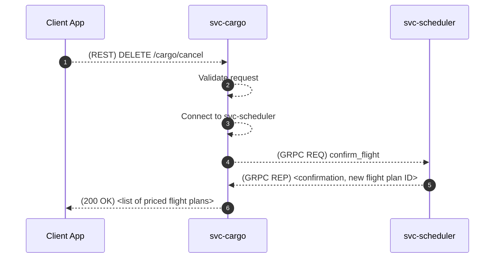

**(cancel) Off-Nominal**: Invalid request body

This can occur if an invalid flight plan ID format is provided by the client.

**(cancel) Off-Nominal**: Unable to connect to svc-scheduler

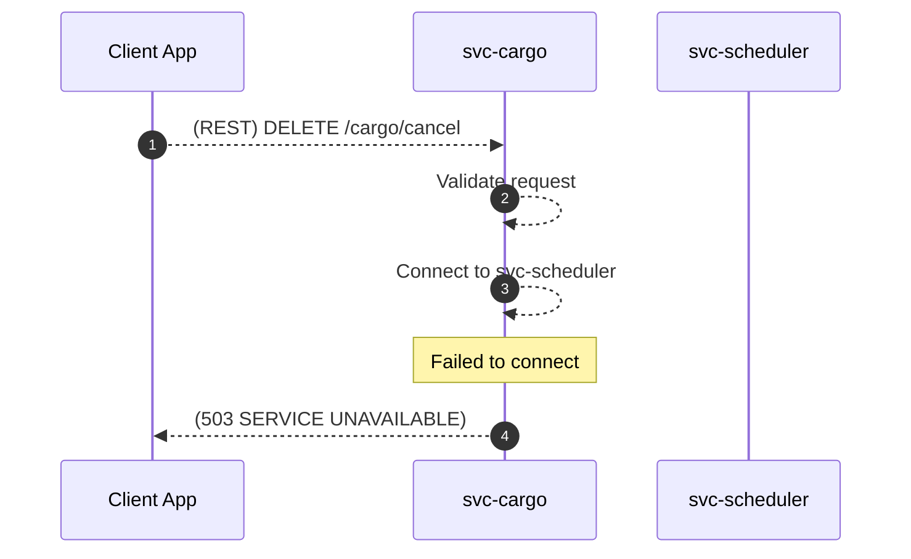

**(cancel) Off-Nominal**: Request to svc-scheduler fails
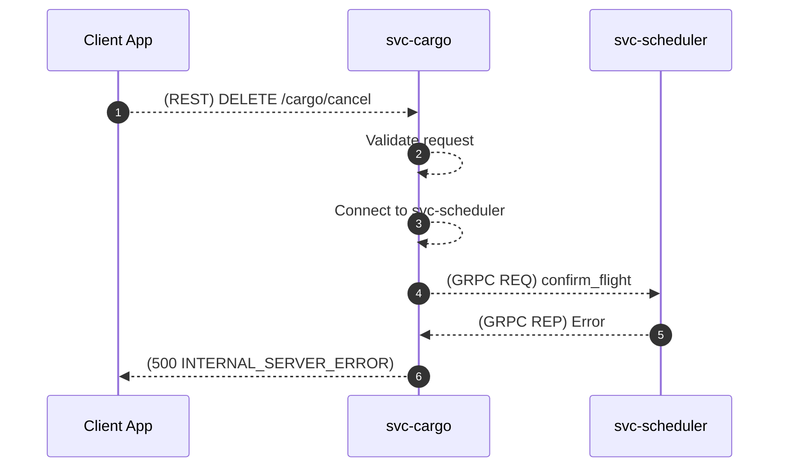
